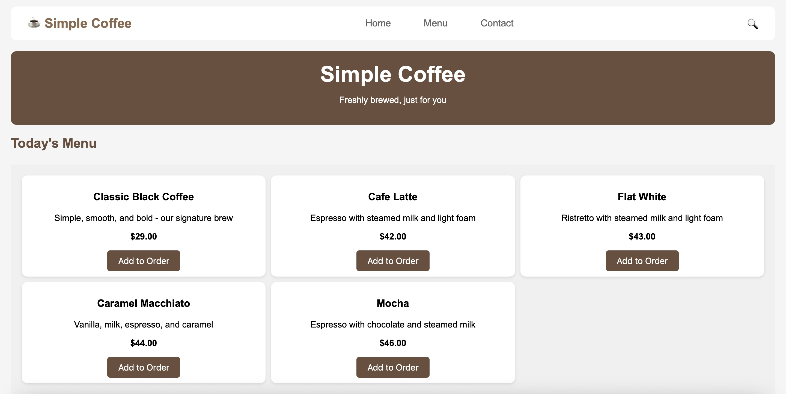
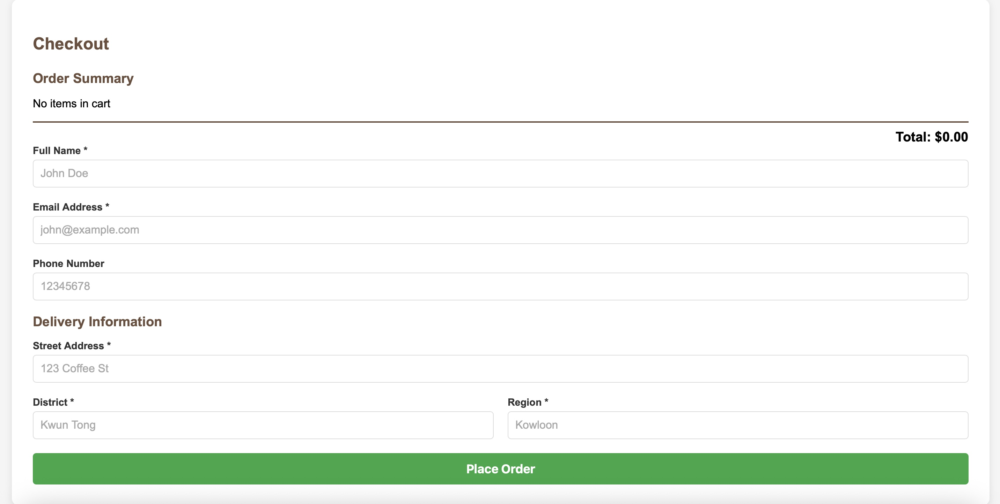
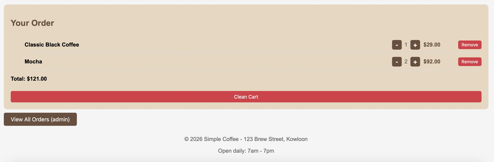
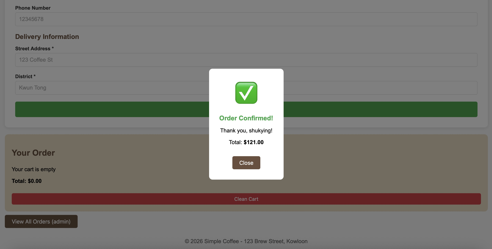
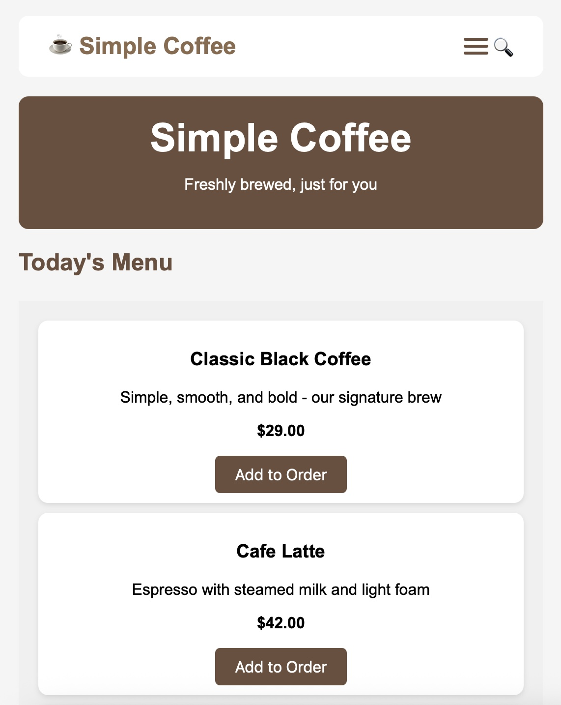

# Simple Coffee - Full-Stack E-commerce Platform 
My self-learning project! 

## Features
### Frontend
- shopping cart
- checkout system
- order management
- HTML, CSS, JavaScript

### Backend
- RESTful API
- Database Integration
- FastAPI, Python, PostgreSQL, JSONB

## Screenshots

